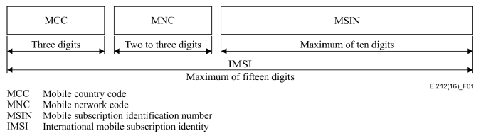

# phonenum

A delphi library for handling mobile phone numbers based on the [ITU REC.E212](https://www.itu.int/rec/T-REC-E.212-201609-I/en) standard.

## Nuances

* Right now this library only supports mobile phone numbers, not fixed ones which can be smaller and out of standard compared to the mobile number standard REC E.212.

* The RECE.212 MNC (mobile network code), the second number after the country code number, is assumed to be the carrier code, the standard mentions that the network code is defined by the country itself, and not the ITU. So for mostry countries, MNC is the carrier code and here assumed as such.

# Table of contents
- [phonenum](#phonenum)
  - [Nuances](#nuances)
- [Table of contents](#table-of-contents)
- [Install](#install)
  - [Using `boss`](#using-boss)
- [Usage](#usage)
- [Standards](#standards)
  - [Representation](#representation)
  - [Country and MNC/DDD Validation](#country-and-mncddd-validation)
  - [Files and sources](#files-and-sources)
- [Tests](#tests)
- [Error handling](#error-handling)
- [TODO](#todo)

# Install

## Using `boss`
Just use the following command:

```console
$ boss install github.com/Joao-Peterson/phonenum
```

If asked for permission, you can login with your github credentials. **(must be done in powershell or cmd with administrator mode)**
```console
$ boss login
> Url to login (ex: github.com): github.com
> Use SSH(y or n):
> n
> Username: your_username
> Password: your_password
```

Note: ssh isn't supported, hence the **'n'** for not using ssh. See this issue with boss: https://github.com/HashLoad/boss/issues/52. Check it out because it may be working in the future.

# Usage

Here a TLDR sample usage for a sample brazillian mobile phone number, where a phone is parsed and created, printed using the brazillian and internacional representation and the country and DDD names are printed, this provides code checking for a number, checking if the country code exists and the DDD brazillian code exists also.

```pascal
procedure handlePhone();
begin
    var p: TphoneNum; 

    try
        p := TphoneNum.CreateFromBrazil('49 5769-8674');
    except
        on E: Exception do raise;
    end;

    WriteLn(p.brazilNumber);
    // 49 95769-8674
    // note that for CreateFromBrazil, numbers without a extra 9 will be corrected

    WriteLn(p.internacionalNumber);
    // 55 49 957698674

    // error will be raised if country or brazil DDD region codes are invalid
    try
        WriteLn(p.countryName);
        // Brazil

        WriteLn(p.dddRegion);
        // Santa Catarina
    except
        on E: Exception do raise;
    end;
end;
```

# Standards

## Representation
This library uses the ITU E.212 IMSI stardard for intrnacional mobile phone numbers representation.



Source: [ITU](https://www.itu.int/rec/T-REC-E.212-201609-I/en).

And furthermore, the MSIN is broken down into two parts in the code, wich are combined when using the internacional representation but separeted while using the common brazillian representation.

## Country and MNC/DDD Validation

Country code validation and naming are based on the official ITU spec and so is the MVC/DDD regional code validation and naming for brazilian regions. **So far only 3 digit country codes are supported**.

Tables for the codes and names for coutries/DDD's are in:

* [countryCodes3DigitNoDuplicates.csv](docs/countryCodes3DigitNoDuplicates.csv)
* [ddd.csv](docs/ddd.csv)

## Files and sources
All sources, standards and tables are in the [docs/](docs/) folder.

# Tests

Tests are done by the [Utests.pas](test/Utests.pas) program using [DunitX](https://github.com/VSoftTechnologies/DUnitX). Just compile the [test.dproj](test/test.dproj) project and execute the tests.

# Error handling

This library raises a `Ephone` exception type on errors, make sure to wrap things around with a `try-except` block.

# TODO

* Validação de numero mobile x fixo
* Melhorar a estrutura das lista de ddd e country code
* Separar funções brasileiras em uma classe separada